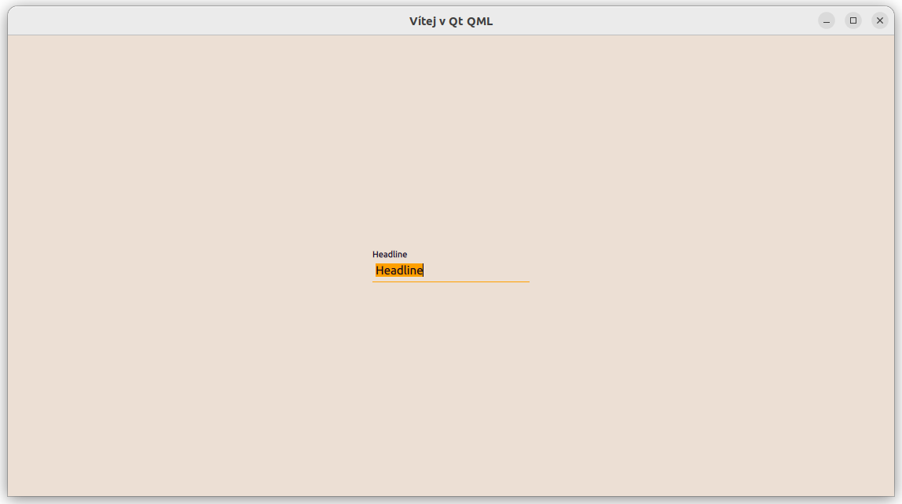
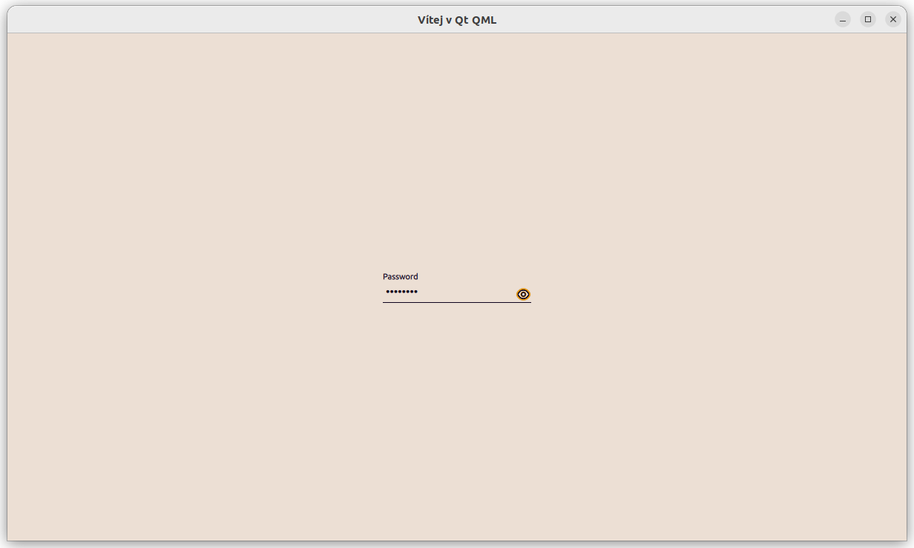
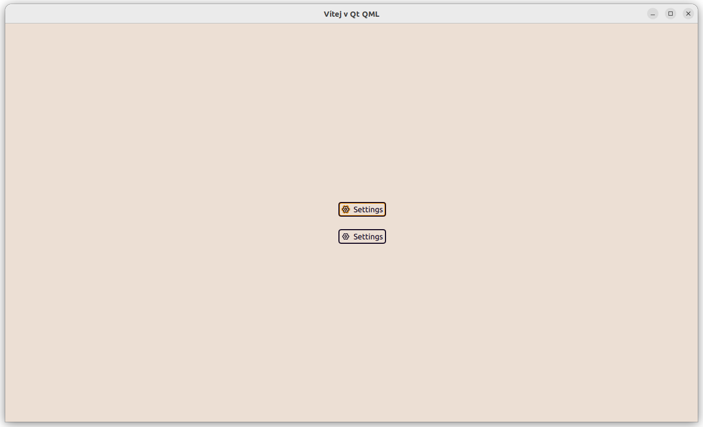
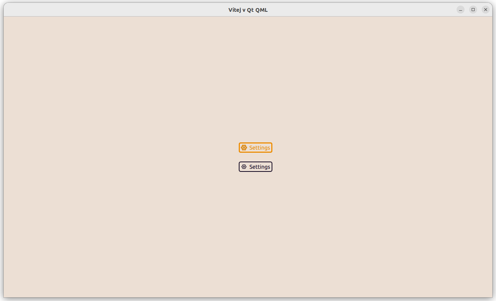
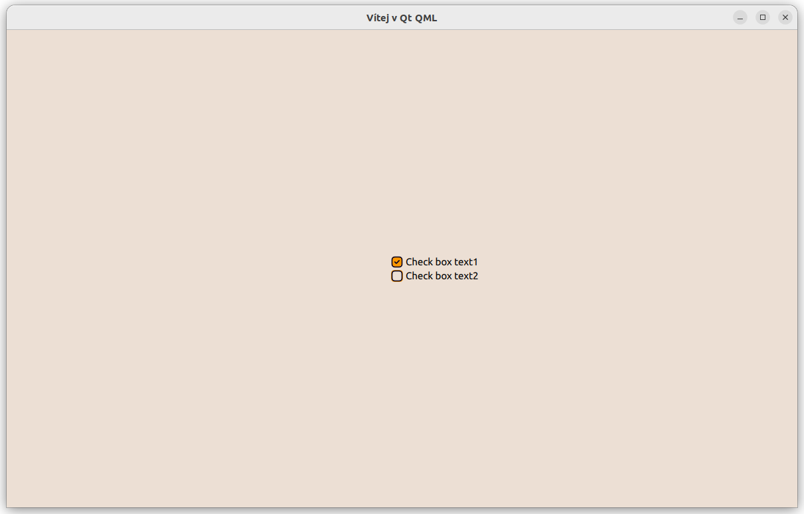
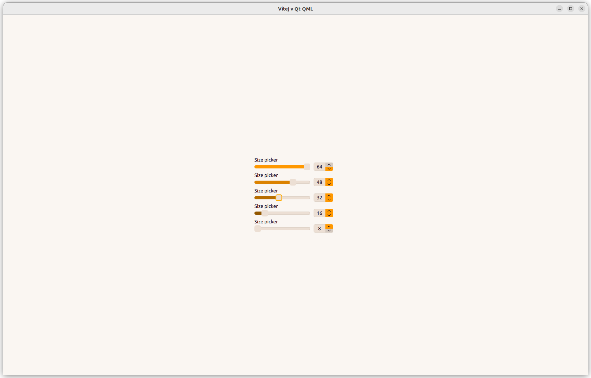
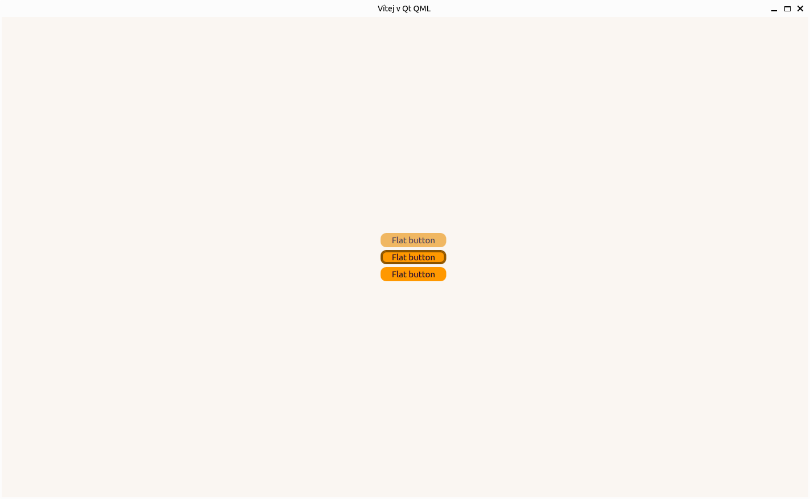

# RainText

## Install

## Using

| Shortcut                                        | Where                         | Description              |
|-------------------------------------------------|-------------------------------|--------------------------|
| <kdb>S</kdb>                                    | Main window                   | Open settings panel      |
| <kdb>A</kdb>  / <kdb>Ctrl</kdb>  + <kdb>N</kdb> | Main window                   | Open add record panel    |
| <kdb>Tabulator</kdb>                            | Everyhere                     | Switch focus to foreward |
| <kdb>Shift</kdb>  + <kdb>Tabulator</kdb>        | Everyhere                     | Switch focus to backward |
| <kdb>Arrow up</kdb>  / <kdb>Arrow right</kdb>   | Sliders / SpinBoxes           | Step up                  |
| <kdb>Arrow down</kdb>  / <kdb>Arrow left</kdb>  | Sliders / SpinBoxes           | Step down                |
| <kdb>H</kdb>  / <kdb>S</kdb>                    | On button "Generate password" | Show / hide password     |
| <kdb>Space</kdb>  / <kdb>Enter</kdb>            | Checkboxes / Buttons          | Click on item            |

## Known issues

- Window work doesn't work properly on wayland

## Customize

### New color scheme

- Name of color scheme must contain `light` or `dark`

## TODO

1. [ ] separate default themes and custom themes
2. [ ] add font load by theme file
3. [ ] create a more advanced error system for loading styles and fixing errors at runtime
4. [ ] add custom style by user (save name to user db)
5. [ ] create more complex shortcuts navigation system (tab-switch only by records and when you enter to item, you should press ctrl-tab to switch another record or press ctrl+enter to go back to focus records)
6. [ ] do first time run tutorial and add it under F1 and button in settings